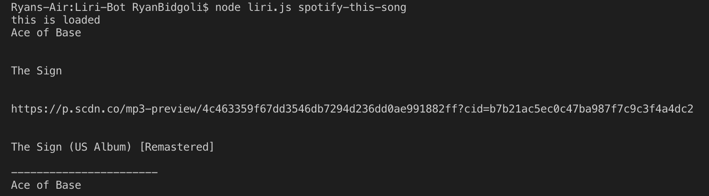
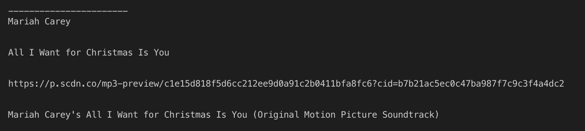
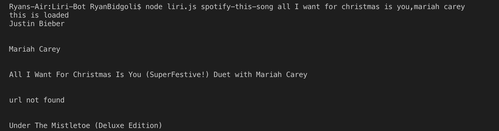
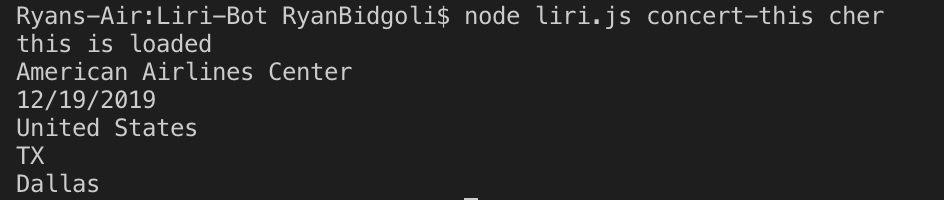
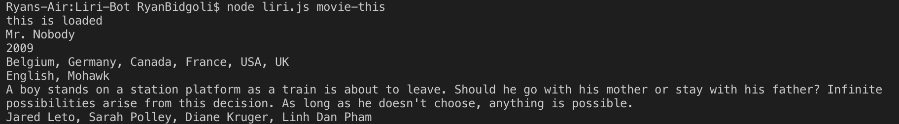
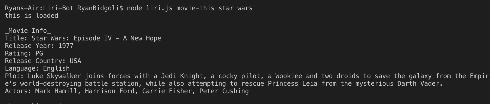

# Liri-Bot

LIRI is a command line node app that takes in parameters and gives you back data based off the following parameters: 

-	concert-this
-	Spotify-this-song
-	movie-this
-	do-what-it-says

## Screenshots:

## Technologies used:

* Spotify API
* OMDB API
* Bands In Town API
* Node.js
* Javascript
* NPM packages
